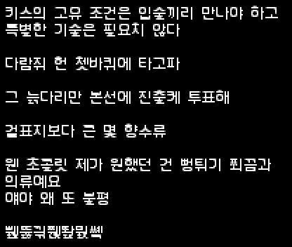

# 말랑체. Mallangche

## 한국어

안티 에일리어싱이 적용된, 픽셀아트 게임과 잘 어울리는 한국어 폰트입니다.

[더 파우더 토이](https://github.com/The-Powder-Toy/The-Powder-Toy)의 한글 입력 지원을 위해 만들어진 폰트로써, 아직까지는 png 형태로만 배포되고 있습니다. 가까운 시일 내로 다른 사용하기 쉬운 포맷들을 지원할 예정입니다.

* `png/jamo.png` : 한글 호환용 자모
* `png/syllables.png` : 현대 한글 11,172자
* `png/syllables_ksx1001.png` : 완성형 2,350자. 완성형 한글 목록은 `png/ksx1001.txt`에서 확인할 수 있습니다.

## English

Korean bitmap font with anti-aliasing, which goes well with pixel-art indie games.

This font is made for Korean input support of [The Powder Toy](https://github.com/The-Powder-Toy/The-Powder-Toy) project, and currently only distributed in png format. We're planning to support many other easy-to-use formats in near future.

* `png/jamo.png` : Hangul compatibility jamo.
* `png/syllables.png` : Full 11,172 hangul syllables.
* `png/syllables_ksx1001.png` : 2,350 syllables selected by frequency. You can check the list of the selected syllables in `png/ksx1001.txt`